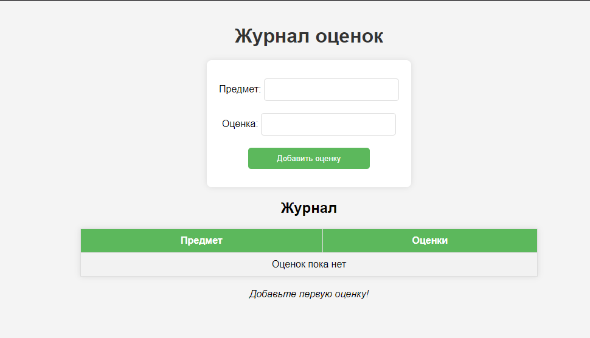

# Задание 5

## Описание

Написать простой веб-сервер для обработки GET и POST HTTP-запросов с помощью библиотеки socket в Python.

## Стек

- Язык: Python
- Библиотека: socket
- Протокол: HTTP

## Как запускать

1. Сервер:
    ```bash
    python3 server.py
    ```
2. Обновление данных

   Через curl:

       curl -X POST -d "subject=Web&grade=5" http://localhost:8080/
       curl --data "subject=Comp&grade=3" http://localhost:8080/

3. Просмотр данных

    a. curl http://localhost:8080/

    b. Просмотреть в браузере страницу
   ```
   http://127.0.0.1:5555
   ```
   
## Код


server.py
```python
import socket
from urllib.parse import unquote_plus

grades = {}


def load_template():
    try:
        with open("template.html", "r", encoding="utf-8") as f:
            return f.read()
    except FileNotFoundError:
        return "<h1>Ошибка: Шаблон template.html не найден.</h1>"


def generate_html():
    template = load_template()

    if not grades:
        rows = "<tr><td colspan='2'>Оценок пока нет</td></tr>"
        message = "Добавьте первую оценку!"
    else:
        rows = ""
        for subject, grade_list in grades.items():
            grades_str = ", ".join(grade_list)
            rows += f"<tr><td>{subject}</td><td>{grades_str}</td></tr>\n"
        message = ""

    return template.replace("{{grades_rows}}", rows).replace("{{message}}", message)


def parse_post_data(body):
    post_data = {}
    if not body:
        return post_data
    params = body.split("&")
    for param in params:
        if "=" in param:
            key, value = param.split("=", 1)
            post_data[key] = unquote_plus(value)
    return post_data


def handle_request(method, body):
    if method == "POST":
        post_data = parse_post_data(body)
        subject = post_data.get("subject", "").strip()
        grade = post_data.get("grade", "").strip()

        if subject and grade:
            if subject in grades:
                grades[subject].append(grade)
            else:
                grades[subject] = [grade]

        return "HTTP/1.1 303 See Other\r\nLocation: /\r\n\r\n"

    response_body = generate_html()
    response = "HTTP/1.1 200 OK\r\nContent-Type: text/html; charset=UTF-8\r\n\r\n" + response_body
    return response


def run_server():
    server_socket = socket.socket(socket.AF_INET, socket.SOCK_STREAM)
    server_socket.bind(("localhost", 8080))
    server_socket.listen(5)
    print("Сервер запущен на порту 8080...")

    while True:
        client_socket, addr = server_socket.accept()
        print(f"Получен запрос от {addr}")

        request_data = client_socket.recv(1024).decode("utf-8")

        if request_data:
            headers, _, body = request_data.partition("\r\n\r\n")
            header_lines = headers.splitlines()
            request_line = header_lines[0]
            method, path, _ = request_line.split()

            content_length = 0
            for line in header_lines:
                if line.lower().startswith("content-length:"):
                    content_length = int(line.split(":")[1].strip())
                    break

            if content_length > 0 and len(body) < content_length:
                body += client_socket.recv(content_length - len(body)).decode("utf-8")

            response = handle_request(method, body)
            client_socket.sendall(response.encode("utf-8"))

        client_socket.close()


if __name__ == "__main__":
    run_server()

```

template.html
```html
<!DOCTYPE html>
<html lang="ru">
<head>
    <meta charset="UTF-8">
    <title>Журнал</title>
    <style>
        body {
            font-family: Arial, sans-serif;
            background-color: #f4f4f4;
            text-align: center;
            margin: 40px;
        }
        h1 {
            color: #333;
        }
        form {
            background: white;
            padding: 20px;
            display: inline-block;
            border-radius: 8px;
            box-shadow: 0px 0px 10px rgba(0, 0, 0, 0.1);
        }
        input, button {
            margin: 10px 0;
            padding: 10px;
            width: 200px;
            border: 1px solid #ddd;
            border-radius: 5px;
        }
        button {
            background-color: #5cb85c;
            color: white;
            border: none;
            cursor: pointer;
        }
        button:hover {
            background-color: #4cae4c;
        }
        table {
            margin: 20px auto;
            border-collapse: collapse;
            width: 50%;
            background: white;
            box-shadow: 0px 0px 10px rgba(0, 0, 0, 0.1);
        }
        th, td {
            border: 1px solid #ddd;
            padding: 10px;
            text-align: center;
        }
        th {
            background-color: #5cb85c;
            color: white;
        }
        tr:nth-child(even) {
            background-color: #f2f2f2;
        }
    </style>
</head>
<body>
    <h1>Журнал оценок</h1>
    <form method="POST">
        <label for="subject">Предмет:</label>
        <input type="text" id="subject" name="subject" required>
        <br>
        <label for="grade">Оценка:</label>
        <input type="text" id="grade" name="grade" required>
        <br>
        <button type="submit">Добавить оценку</button>
    </form>

    <h2>Журнал</h2>

    <table border="1">
        <tr>
            <th>Предмет</th>
            <th>Оценки</th>
        </tr>
        {{grades_rows}}
    </table>

    <p><i>{{message}}</i></p>

</body>
</html>

```

## Скриншоты

