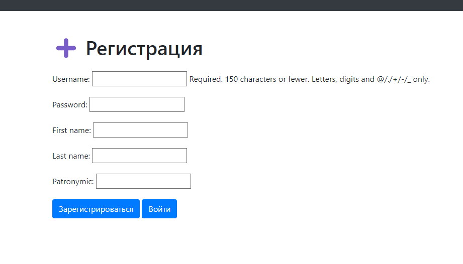
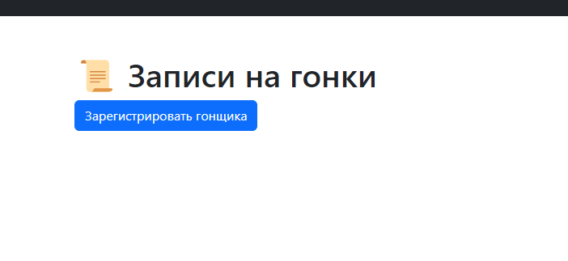
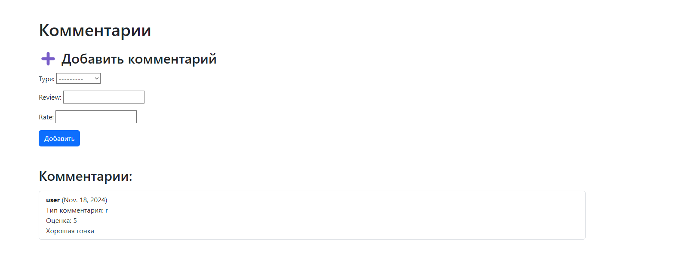

# Лабораторная работа №2

Табло должно отображать информацию об участниках автогонок: ФИО участника,
название команды, описание автомобиля, описание участника, опыт и класс участника.
Необходимо реализовать следующий функционал:

- Регистрация новых пользователей.
- Просмотр автогонок и регистрацию гонщиков. Пользователь должен иметь
  возможность редактирования и удаления своих регистраций.
- Написание отзывов и комментариев к автогонкам. Предварительно
  комментатор должен зарегистрироваться. При добавлении комментариев
  должны сохраняться даты заезда, текст комментария, тип комментария
  (вопрос о сотрудничестве, вопрос о гонках, иное), рейтинг (1-10),
  информация о комментаторе.
- Администратор должен иметь возможность указания времени заезда и
  результата средствами Django-admin.
- В клиентской части должна формироваться таблица всех заездов и
  результатов конкретной гонки.

## Ход выполнения работы

### models.py:
```python
  class User(AbstractUser):
      first_name = models.CharField(max_length=30, blank=True)
      last_name = models.CharField(max_length=30, blank=True)
      patronymic = models.CharField(max_length=30, blank=True, null=True)
      has_racer = models.BooleanField(default=False)
  
  
  class Racer(models.Model):
      user = models.OneToOneField(User, on_delete=models.CASCADE)
      team_name = models.CharField(max_length=100)
      car_description = models.CharField(max_length=200)
      description = models.CharField(max_length=200)
      experience = models.IntegerField()
      racer_class = models.CharField(max_length=100)
  
  
  class Race(models.Model):
      race_statuses = (
          ('r', 'registration'),
          ('i', 'in progress'),
          ('e', 'ended')
      )
      date_of_race = models.DateField(name='date_of_race')
      status = models.CharField(choices=race_statuses, max_length=1)
      winner = models.ForeignKey(Racer, blank=True, null=True, on_delete=models.SET_NULL)
  
  
  class RaceConnection(models.Model):
      racer = models.ForeignKey(Racer, on_delete=models.CASCADE)
      race = models.ForeignKey(Race, on_delete=models.CASCADE)
  
  
  class Review(models.Model):
      review_types = (
          ('p', 'partnership'),
          ('r', 'race'),
          ('o', 'other')
      )
      author = models.ForeignKey(User, on_delete=models.CASCADE)
      race = models.ForeignKey(Race, on_delete=models.CASCADE)
      type = models.CharField(choices=review_types, max_length=1)
      review = models.CharField(max_length=1000)
      rate = models.IntegerField(validators=[MinValueValidator(1), MaxValueValidator(10)])
```


### forms.py:

    class LoginForm(forms.Form):
    username = forms.CharField()
    password = forms.CharField(widget=forms.PasswordInput)


    class RegisterForm(forms.ModelForm):
        class Meta:
            model = User
            fields = ['username', 'password', 'first_name', 'last_name', 'patronymic']
    
    
    class RacerForm(forms.ModelForm):
        class Meta:
            model = Racer
            fields = ['team_name', 'car_description', 'description', 'experience', 'racer_class']
    
    
    class RaceResultsForm(forms.ModelForm):
        class Meta:
            model = RaceConnection
            fields = ['race']
    
    class ReviewForm(forms.ModelForm):
        class Meta:
            model = Review
            fields = ['type', 'review', 'rate']

### urls.py:

    urlpatterns = [
    path("", views.races_list, name=""),
    path('login/', views.user_login, name='login'),
    path('logout/', views.user_logout, name='logout'),
    path('profile/', views.dashboard, name='profile'),
    path("registration/", views.registration, name="registration"),
    path("racer_registration/", views.racer_registration, name="racer_registration"),
    path("races/comments/<int:race_id>/", views.race_reviews, name="race_comments"),
    path("races/", views.races_list, name="races_list"),
    path("races_pivot/", views.RacesPivotListView.as_view(), name="races_adm_list"),
    path("create_race_connection/<int:race_id>/", views.create_race_connection, name="create_race_connection"),
    path("delete_race_connection/<int:race_id>", views.delete_race_connection, name="delete_race_connection")

]

## Результат

### Главная страница:


### Страница регистрации:


### Страница авторизации:


### Регистрация гонщика:


### Регистрация на гонку:


### Список регистраций гонщика


### Добавление комментария к гонке:


### Просмотр сводной таблицы
