# Лабораторная работа 3. Реализация серверной части на django rest. Документирование API

## Описание эндпоинтов

### Individual Clients
1. **Получить список клиентов**
```
GET /clients/
```


2. **Получить информацию о клиенте**
```
GET /clients/{id}/
```
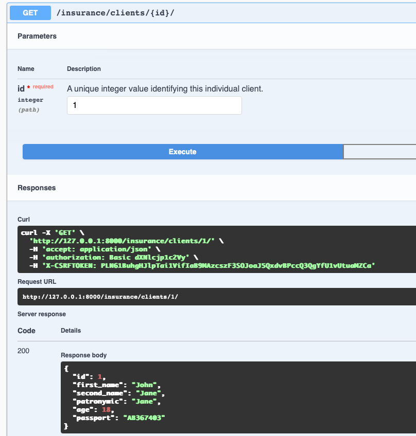

3. **Создать клиента**
```
POST /clients/
```


4. **Обновить клиента**
```
PUT /clients/{id}/
```


5. **Частично обновить клиента**
```
PATCH /clients/{id}/
```


6. **Удалить клиента**
```
DELETE /clients/{id}/
```


### Agents
1. **Получить список агентов**
```
GET /agents/
```


2. **Получить информацию об агенте**
```
GET /agents/{id}/
```


3. **Создать агента**
```
POST /agents/
```


4. **Обновить агента**
```
PUT /agents/{id}/
```


5. **Частично обновить агента**
```
PATCH /agents/{id}/
```
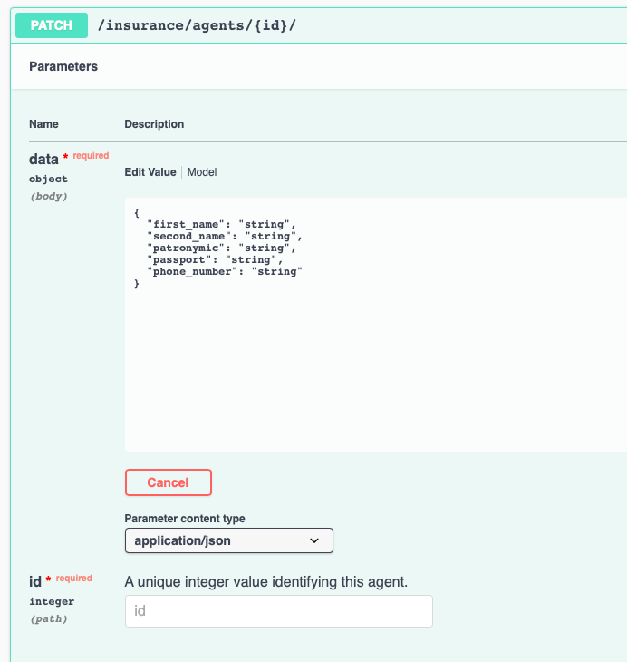

6. **Удалить агента**
```
DELETE /agents/{id}/
```


### Individual Contracts
1. **Получить список индивидуальных контрактов**
```
GET /clients/contracts
```


2. **Получить информацию об индивидуальном контракте**
```
GET /clients/contracts/{id}/
```
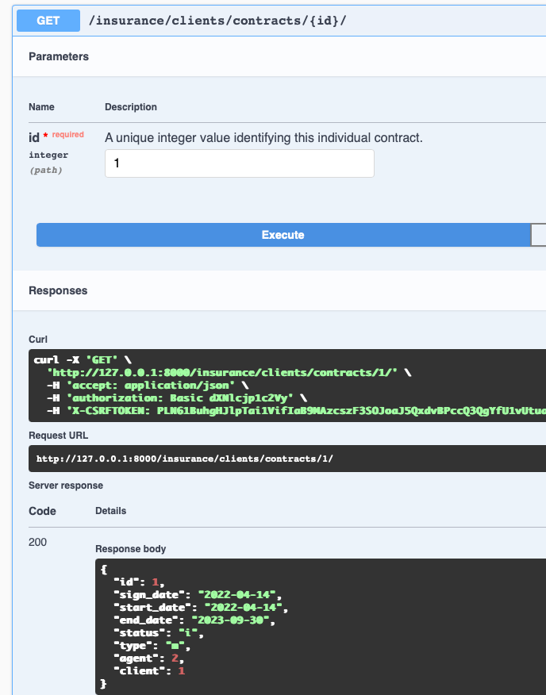
3. **Создать индивидуальный контракт**
```
POST /clients/contracts
```

4. **Обновить индивидуальный контракт**
```
PUT /clients/contracts/{id}/
```
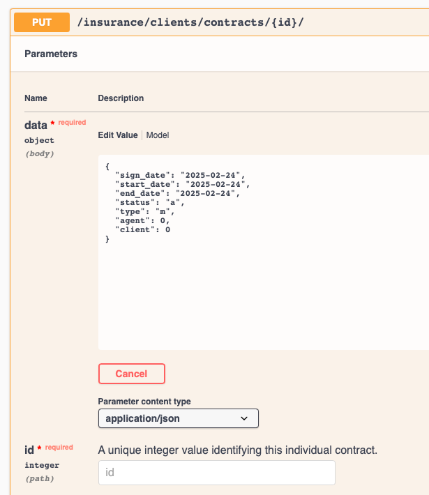

5. **Частично обновить индивидуальный контракт**
```
PATCH /clients/contracts/{id}/
```

6. **Удалить индивидуальный контракт**
```
DELETE /clients/contracts/{id}/
```
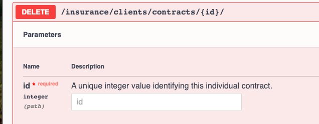

### Labor Contracts
1. **Получить список трудовых контрактов**
```
GET /agents/contracts/
```
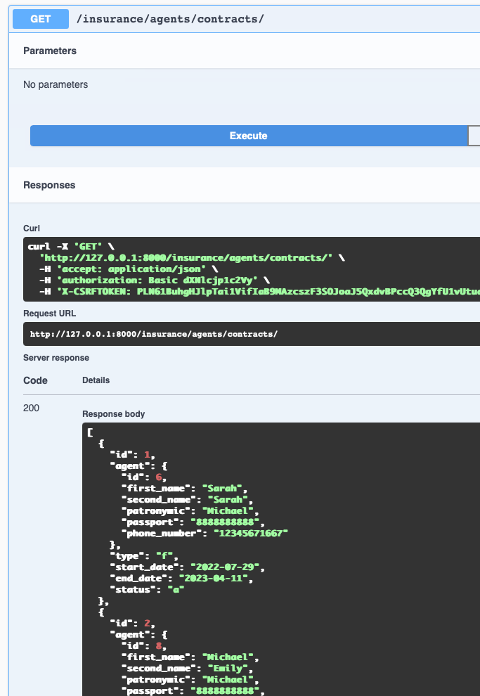

2. **Получить информацию о трудовом контракте**
```
GET /agents/contracts/{id}/
```
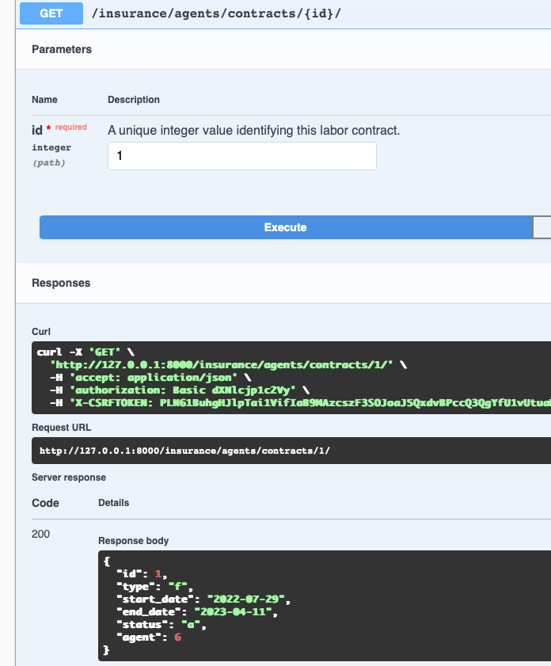

3. **Создать трудовой контракт**
```
POST /agents/contracts/
```
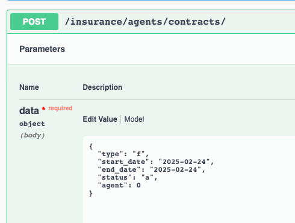
4. **Обновить трудовой контракт**
```
PUT /agents/contracts/{id}/
```

5. **Частично обновить трудовой контракт**
```
PATCH /agents/contracts/{id}/
```


6. **Удалить трудовой контракт**
```
DELETE /agents/contracts/{id}/
```


### Organizations
1. **Получить список организаций**
```
GET /organizations/
```
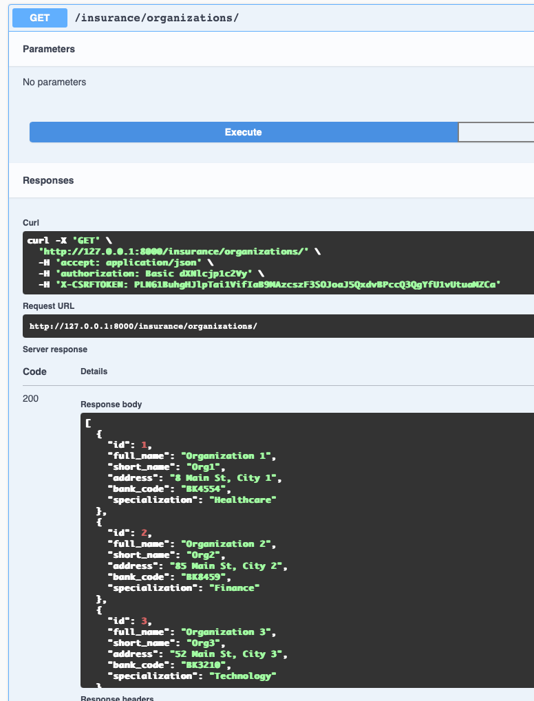
2. **Получить информацию об организации**
```
GET /organizations/{id}/
```
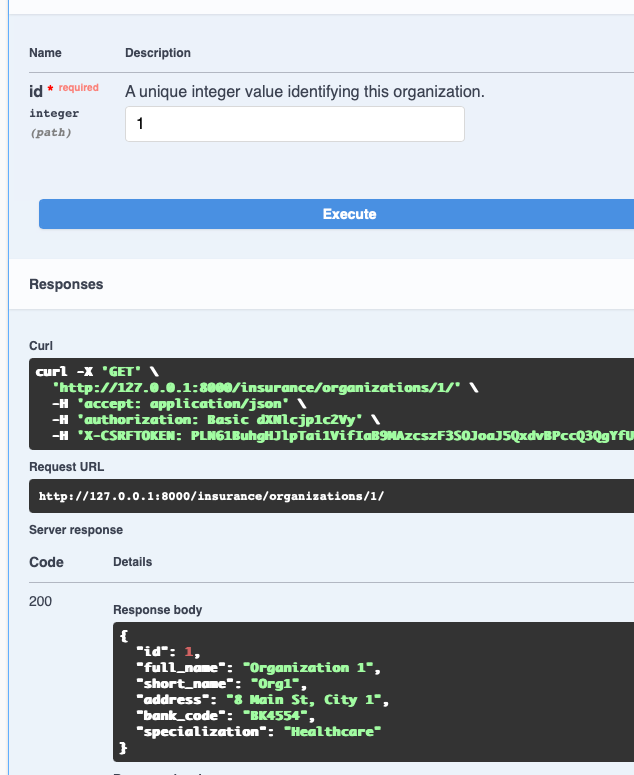

3. **Создать организацию**
```
POST /organizations/
```


4. **Обновить организацию**
```
PUT /organizations/{id}/
```

5. **Частично обновить организацию**
```
PATCH /organizations/{id}/
```
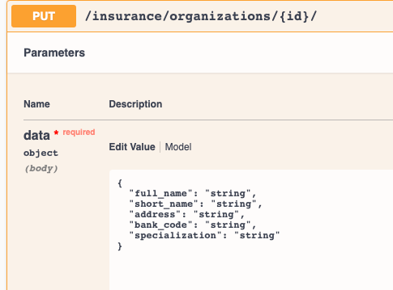


## views.py (отрывок)

    class IndividualClientAPIView(GenericAPIView):
        permission_classes = [IsAuthenticated]
        serializer_class = IndividualClientSerializer
    
        def get(self, request):
            clients = IndividualClient.objects.all()
            serializer = IndividualClientSerializer(clients, many=True)
            return Response(serializer.data)
    
        def post(self, request):
            serializer = IndividualClientSerializer(data=request.data, many=True)
            if serializer.is_valid():
                serializer.save()
                return Response(serializer.data, status=status.HTTP_201_CREATED)
            return Response(serializer.errors, status=status.HTTP_400_BAD_REQUEST)
    
    
    class IndividualClientDetailView(generics.RetrieveUpdateDestroyAPIView):
        permission_classes = [IsAuthenticated]
        serializer_class = IndividualClientSerializer
        queryset = IndividualClient.objects.all()
    
    
    class AgentAPIView(GenericAPIView):
        permission_classes = [IsAuthenticated]
        serializer_class = AgentSerializer
    
        def get(self, request):
            agents = Agent.objects.all()
            serializer = AgentSerializer(agents, many=True)
            return Response(serializer.data)
    
        def post(self, request):
            serializer = AgentSerializer(data=request.data, many=True)
            if serializer.is_valid():
                serializer.save()
                return Response(serializer.data, status=status.HTTP_201_CREATED)
            return Response(serializer.errors, status=status.HTTP_400_BAD_REQUEST)
